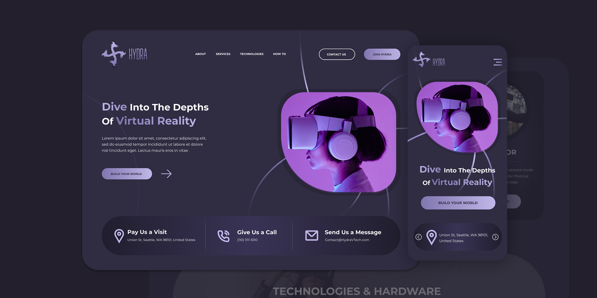

<h1 align=center>Hydra Landing Page</h1>

Transforming a design into a responsive webpage using TailwindCSS to learn the framework and apply a few new Angular features like signal inputs, queries, and built-in control flow

- [Angular](https://angular.dev/)
- [TailwindCSS](https://tailwindcss.com/)
- [Figma Design](https://www.figma.com/community/file/1196146735025729739/hydra-landing-page?searchSessionId=ly4jjiix-eo9z46kf75w)

___

 ### TODO :pencil2::

- Custom swiping functionality on mobile view

